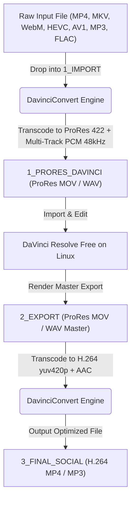
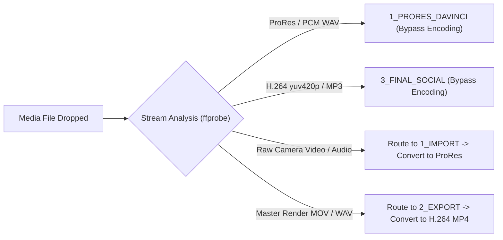

# DavinciConvert

DavinciConvert is an automated media transcoding utility designed specifically for DaVinci Resolve Free on Linux and social media video publishing.

---

## About the Project

DaVinci Resolve Free on Linux has native codec and container limitations due to proprietary software licensing restrictions:
- No native H.264 or H.265 video decoding within standard media containers.
- No native AAC audio decoding, which results in imported clips having missing or silent audio.
- Format incompatibilities when exporting edited footage back to web platforms (such as missing `yuv420p` pixel format support on mobile devices).

DavinciConvert automates the entire preparation and export pipeline:
1. **Import (To DaVinci):** Converts raw video and audio files into Apple ProRes 422 MOV and uncompressed 16-bit 48kHz PCM audio, ensuring smooth scrubbing and full timeline compatibility.
2. **Export (To Social Media):** Converts master renders from DaVinci Resolve back into lightweight H.264 MP4 (`yuv420p`) and AAC audio for Instagram, TikTok, YouTube Shorts, and web distribution.

---

## Key Features

- **Multi-Audio Track Preservation:** Automatically maps and preserves all independent audio streams from OBS Studio recordings (Microphone, Game Audio, Discord) into separate audio tracks for DaVinci Resolve.
- **Desktop Notifications:** Sends native OS desktop notifications via `notify-send` when batch processing completes.
- **Linux Desktop Launcher:** Generates and installs a native `.desktop` application launcher into GNOME / Fedora application menus via `--install-desktop`.
- **Safety Archive Option:** Option to move original raw files into an `ARCHIV/` directory via `--archive` instead of deleting them.
- **Subtitle & Chapter Preservation:** Preserves embedded subtitle tracks and chapter markers during transcoding.
- **Universal Smart Routing Matrix:** Uses `ffprobe` to inspect media streams directly and reroutes misplaced files across folders automatically.
- **Hardware Acceleration:** Auto-probes NVIDIA NVENC, Intel QSV, and AMD VA-API with zero-crash CPU multi-threading fallback.
- **Instant Cancellation:** Pressing Ctrl+C or closing the terminal window terminates FFmpeg immediately in 0.0001s.

---

## System Architecture and Workflow

DavinciConvert operates using a four-directory workflow.

### Directory Structure

```text
DavinciConvert/
├── 1_IMPORT/          Input directory for raw videos and audio files
├── 1_PRORES_DAVINCI/  Output directory containing converted ProRes MOV and WAV PCM files
├── 2_EXPORT/          Input directory for master renders exported from DaVinci Resolve
├── 3_FINAL_SOCIAL/    Output directory containing optimized H.264 MP4 and MP3 files
└── ARCHIV/            (Optional) Safety archive directory for original input files
```

### Media Processing Pipeline



---

## Universal Smart Routing Matrix

DavinciConvert uses `ffprobe` to inspect media streams directly rather than relying on file extensions. If a file is placed in an incorrect directory by mistake, the script automatically routes it to the appropriate processing pipeline.



---

## Usage Instructions

### Prerequisites

Ensure `bash` and `ffmpeg` (with `ffprobe`) are installed.

```bash
# Fedora / RHEL
sudo dnf install ffmpeg

# Ubuntu / Debian
sudo apt update && sudo apt install ffmpeg

# Arch Linux
sudo pacman -S ffmpeg
```

### Command Line Options

```text
Usage: ./davinciconvert.sh [OPTIONS]

Options:
  -w, --watch            Watch directory continuously for new files
  -a, --archive          Move original raw files to ARCHIV/ folder instead of deleting
  -q, --quality <lt|std|hq>  Set ProRes quality profile (lt = ProRes LT, std = Standard, hq = ProRes HQ)
  -p, --preset <preset>   Set CPU encoding speed (ultrafast, superfast, fast, medium, slow)
  --install-desktop      Install Linux Desktop Launcher into application grid
  -h, --help             Show help menu
```

### Running the Transcoder

#### Single Pass Execution
Double-click `davinciconvert.sh` (or `START.sh`) from your desktop environment, or run it via the command line:

```bash
./davinciconvert.sh
```

An interactive terminal window will automatically launch, displaying real-time encoding stats and progress. To stop execution at any point, close the terminal window or press `Ctrl+C`.

#### Installing Desktop Launcher
To add DavinciConvert to your Linux application menu (GNOME / Fedora App Grid):

```bash
./davinciconvert.sh --install-desktop
```

#### Continuous Watch Mode
To keep DavinciConvert running in the background and continuously monitor directories for newly added files:

```bash
./davinciconvert.sh --watch
```

---

## OBS Studio Configuration Guide

To record footage directly in a native DaVinci-compatible format on Linux without pre-transcoding, configure OBS Studio as follows:

1. Open **OBS Studio -> Settings -> Output -> Recording**.
2. Set **Output Type** to `Custom Output (FFmpeg)`.
3. Set **Container Format** to `mov`.
4. Set **Video Encoder** to `dnxhd` (or `prores_ks`).
5. Set **Audio Encoder** to `pcm_s16le` (or `pcm_s24le`).

---

## Bitrate and Quality Specifications

| Resolution | Aspect Ratio Support | DaVinci Import Profile | Social Export Bitrate (<= 32 FPS) | Social Export Bitrate (> 32 FPS) |
| :--- | :--- | :--- | :--- | :--- |
| 4K (2160p) | Widescreen 16:9 / Vertical 9:16 | ProRes 422 Standard | 28 Mbps | 35 Mbps |
| 2K (1440p) | Widescreen 16:9 / Vertical 9:16 | ProRes 422 LT | 18 Mbps | 22 Mbps |
| Full HD (1080p) | Widescreen 16:9 / Vertical 9:16 | ProRes 422 LT | 12 Mbps | 15 Mbps |
| HD (720p) | Widescreen 16:9 / Vertical 9:16 | ProRes 422 LT | 8 Mbps | 10 Mbps |

---

## License

This project is licensed under the [MIT License](LICENSE).
